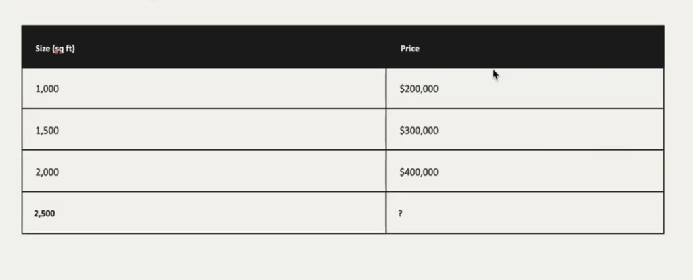
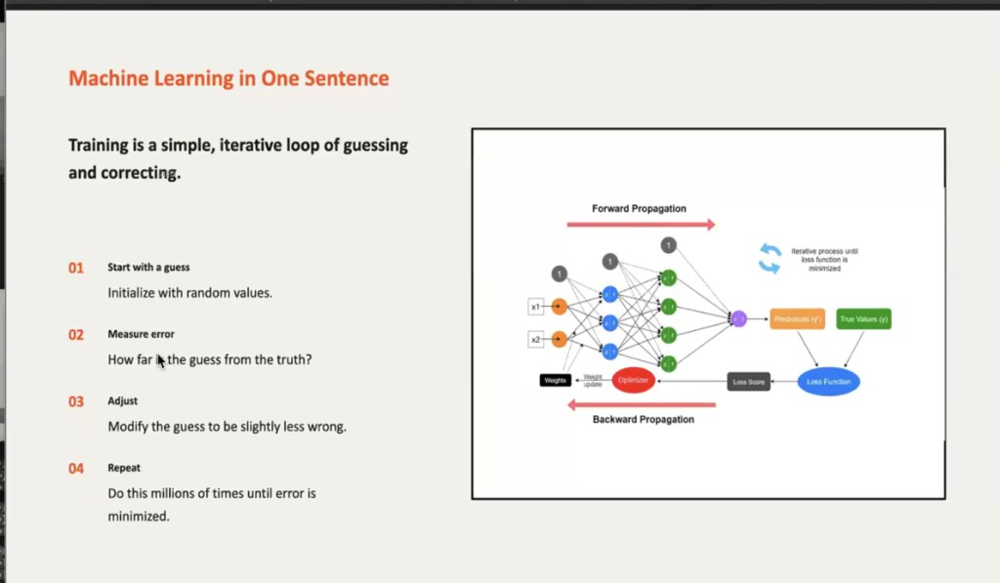
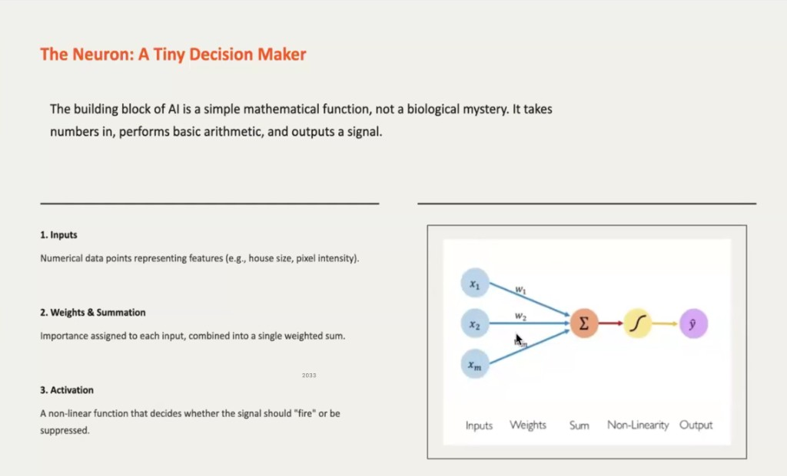
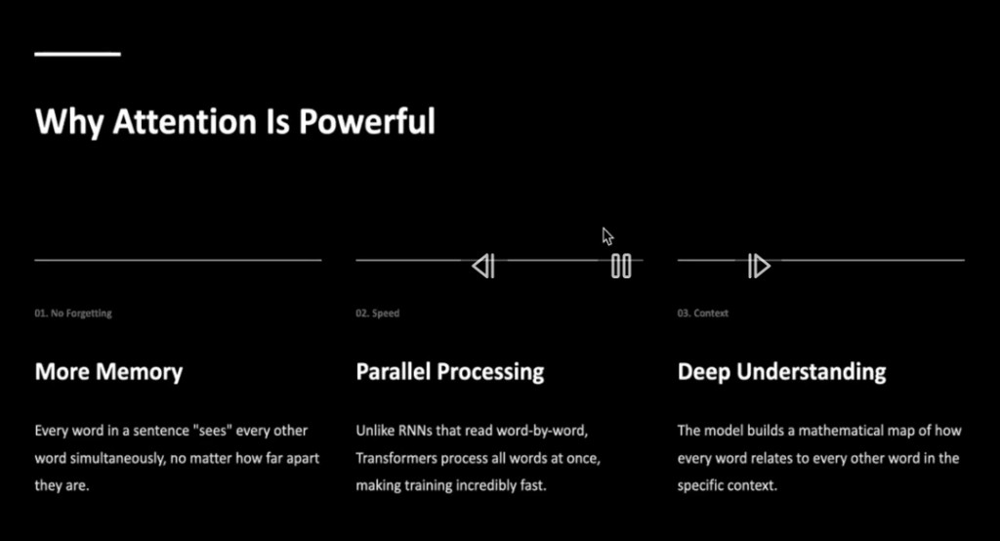
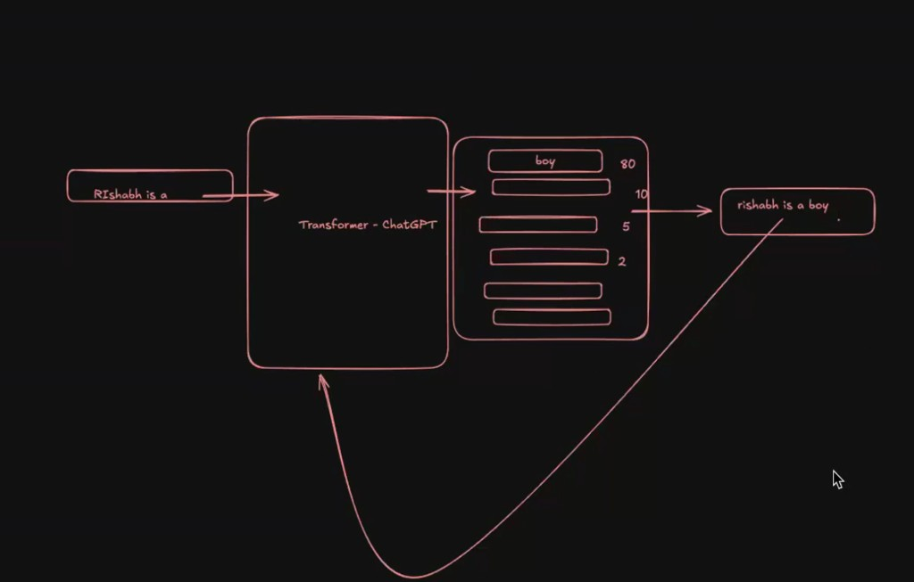
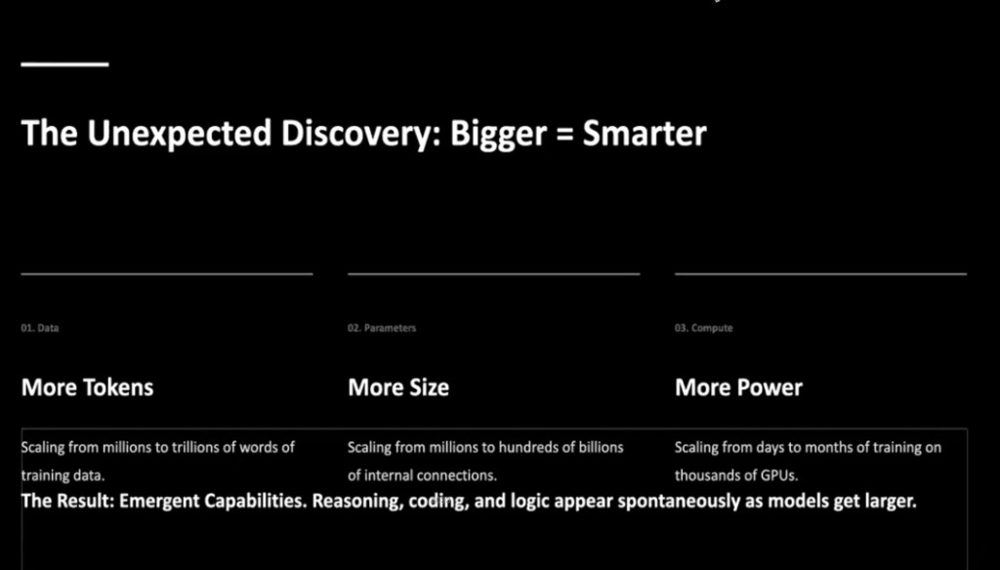
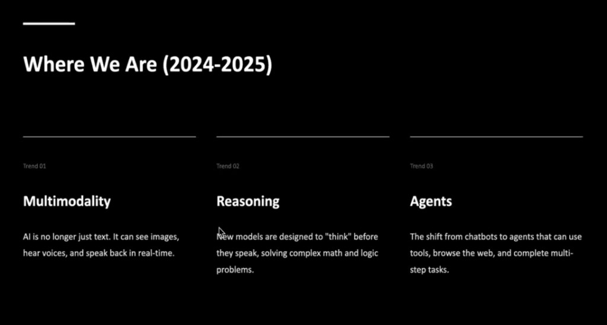

# Neural networks and modern AI (notes)

Machine learning is basically **finding patterns in data**.

---

## A simple prediction example

You might predict **price from size** using a few examples. The relationship can be learned (here it is linear: about **$200 per square foot**).

For 2,500 sq ft, a model that fits this pattern would predict **$500,000**.

---

## Machine learning in one sentence

**Training is a simple, iterative loop of guessing and correcting.**

1. **Start with a guess** — initialize parameters (often randomly).
2. **Measure error** — compare predictions to true labels.
3. **Adjust** — update parameters so the guess is a little less wrong.
4. **Repeat** — many times until the error is small enough.

---

## The neuron: a tiny decision maker

The building block of many models is a **simple mathematical function**: numbers in, arithmetic, signal out.

In practice, one artificial neuron usually does the following:

1. **Inputs** — numerical features (e.g. house size, pixel intensity).
2. **Weights** — each input is multiplied by a learned weight (how much it matters).
3. **Summation** — add the weighted inputs (and often a **bias** term).
4. **Activation** — pass the result through a (usually) non-linear function.
5. **Output** — the neuron’s value feeds the next layer or the final prediction.

---

## Why do we need an activation function?

**The linearity problem:** if every layer were only linear, stacking many layers would still be equivalent to **one** linear mapping. Non-linear activations let networks represent richer patterns.

---

## From words to sequences

- **Word embeddings** — words can be represented as **vectors of numbers**.
- Early embeddings often treat tokens somewhat independently; language is ordered, so we also need **sequence** models.
- **RNNs (sequence models)** — process a sentence step by step and build context as you go. That works for shorter sequences but gets **slow** and harder for **long-range** dependencies as length grows.

---

## Transformers and attention

**Transformers** look at a much larger context **in parallel** (not strictly one word at a time like a classic RNN). Their key idea is **self-attention**: learn which parts of the input should influence each other.

The secret is the **attention mechanism** — focusing on **relevant** parts of the sequence for each position.

- **Vision:** self-attention can be applied to images (e.g. **image transformers**).
- **Audio:** similar ideas apply (e.g. **audio transformers**).

**Large language models (LLMs)** and **small language models (SLMs)** are typically built on **transformer** blocks and **self-attention**.

---

## How ChatGPT-style models work

They are usually trained to predict the **next token** (word or subword). That prediction is fed back in, and the process repeats — **autoregressive** generation.

---

## Scaling: data, size, and compute

Performance often improves when you scale **training data**, **model size (parameters)**, and **compute**. Very large setups can show **emergent** behaviors (e.g. stronger reasoning or coding) that were not hand-coded.

---

## Where we are (2024–2026)

Major trends include **multimodality** (text, images, speech), **reasoning-focused** models, and **agents** that use tools and multi-step plans.

