# Transformers: tokenization, embeddings, and position

**Tokenization** is the process of turning raw text into a **sequence of tokens** (often subwords), each with an integer ID. That sequence is what the model actually “reads.”

---

## Why not one token per character?

**Character-level** tokenization is possible, but it tends to be **too granular**:

- Sequences get **very long** for the same text.
- The model must work hard to build **word- and phrase-level** structure from individual letters.

So most production language models use **subwords**, not raw characters only.

---

## Why not one token per word?

**Word-level** tokenization (one ID per whole word) is intuitive—e.g. `"The cat sat"` → `[1, 2, 3]`—but it runs into real issues:

- **Morphology:** `"cat"`, `"cats"`, and `"cat's"` may be treated as unrelated unless you add many variants.
- **Typos and rare terms:** e.g. `"teh"` or specialized jargon may be **out of vocabulary (OOV)**.
- **Huge vocabularies:** you cannot list every word you will ever see.

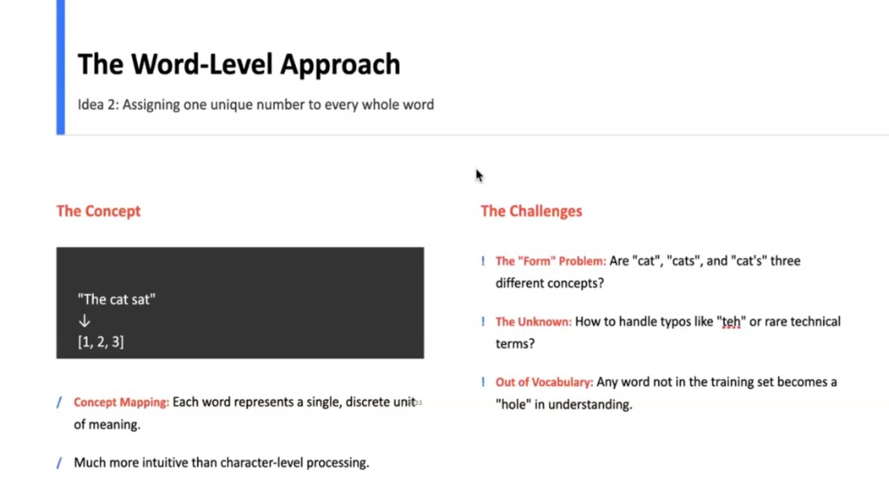

---

## The subword solution

**Subword** tokenizers strike a balance: pieces are **bigger than single characters** but **smaller than full words** when needed. Common words often stay **whole**; rare or long words split into **frequent chunks** (e.g. `"understanding"` → pieces like `under`, stand, ing). Typical vocabs are on the order of **tens of thousands** of tokens.

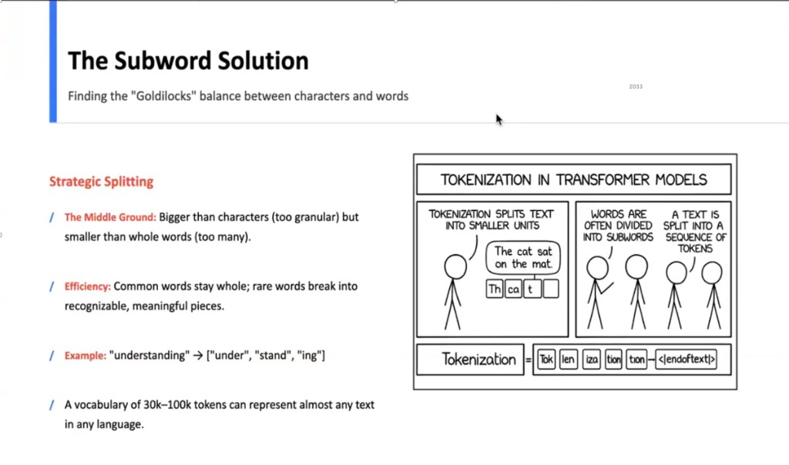

---

## Byte Pair Encoding (BPE)

**BPE** is a common way to **build** a subword vocabulary from data:

1. Start from **single characters** (or bytes).
2. **Repeatedly merge** the most frequent adjacent pair into a new token.
3. Stop when you reach a target **vocabulary size**.
4. Frequent patterns become **single tokens**; rare text stays **split** into known pieces (better than marking whole words as unknown).

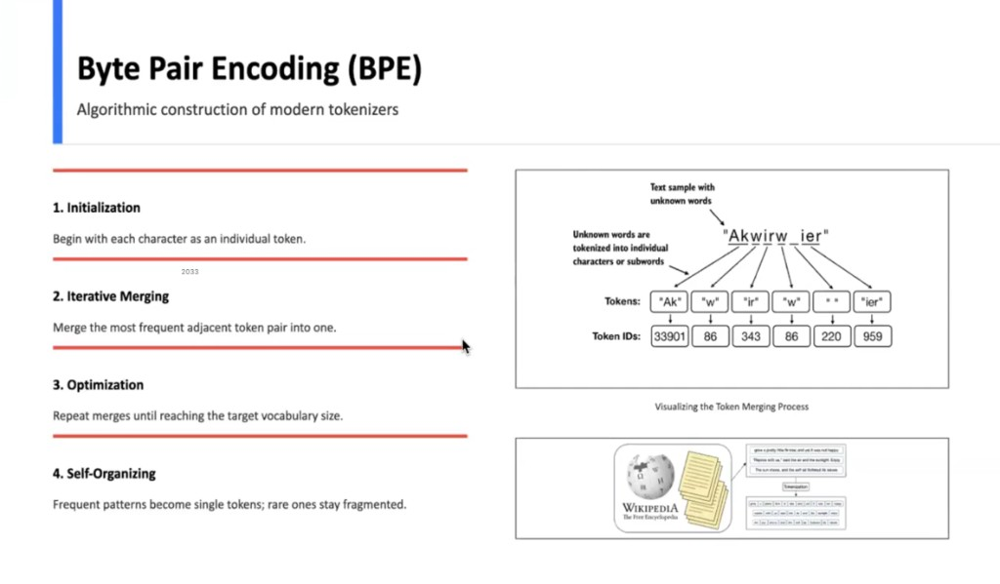

---

## Tokenization in modern practice (GPT-style)

Real tokenizers add conventions that matter for decoding and quality:

| Topic | Example idea |
|--------|----------------|
| **Spaces** | Leading space often attaches to the **next** token: `"Hello world"` → `["Hello", " world"]`. |
| **Contractions** | Splits reflect learned pieces, e.g. `"don't"` → `["don", "'t"]`. |
| **Long / rare words** | Subwords may not match linguistic syllables, e.g. `"artificial intelligence"` might split like `"art"`, `"ificial"`, `" intelligence"`. |

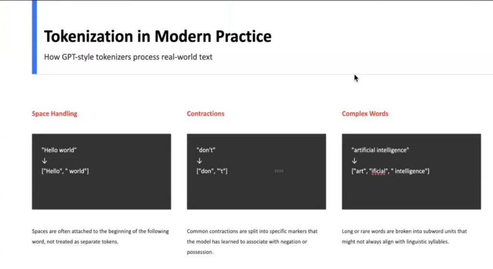

---

## Why tokenization matters

**Granularity:** characters are often **too fine**, whole-word lists are **too large** and brittle; **subwords** are usually **just right**.

**Operational impact:** awkward tokenization makes the model waste capacity on encoding noise and can cause odd failures on simple tasks. **If the model cannot “see” a clean pattern in the tokens, it struggles to learn meaning.**

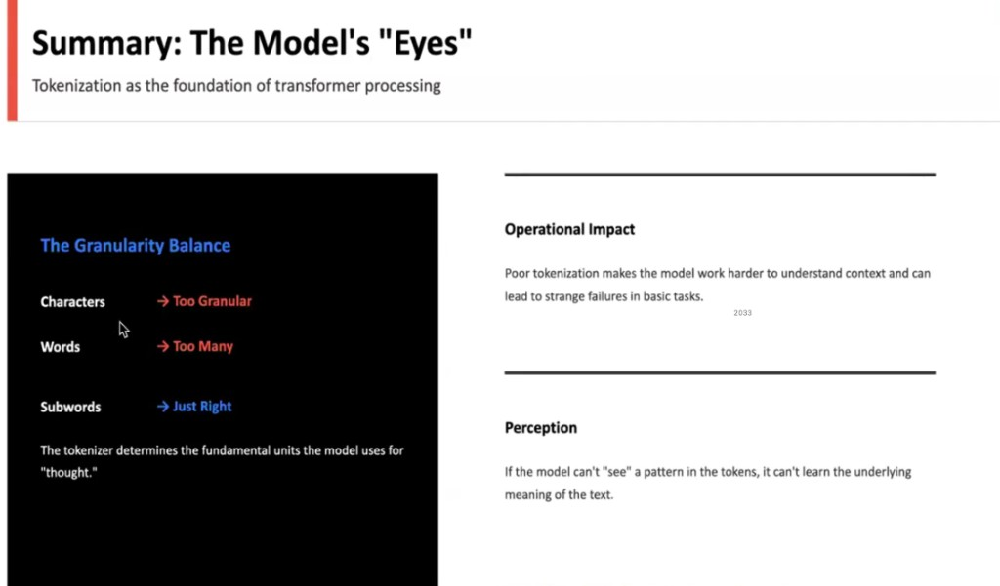

**Practical limits:** APIs and chat UIs quote limits in **tokens** (e.g. a **200k-token** context window means roughly that many subword tokens, not “words” in the human sense).

**Tools:** use a **tokenizer visualizer** (e.g. OpenAI/Hugging Face tokenizer demos) to see how a string splits into IDs for a given model.

---

## From token IDs to meaning

Integer IDs from a vocabulary are **arbitrary**: ID `15496` does not “mean” greeting by itself. The model needs **dense vectors** where **geometry reflects semantics**—similar meanings should be **close** in vector space.

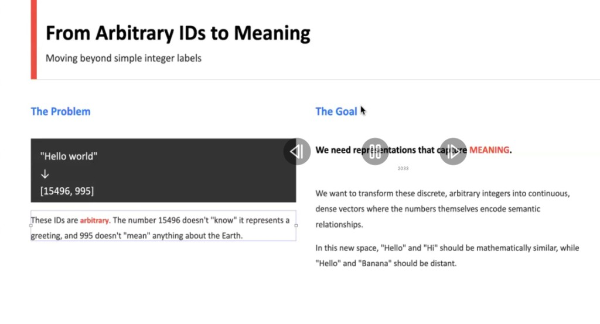

---

## Embeddings

An **embedding** maps each token ID to a **vector** (a list of floats). In similar-meaning space:

- **Nearby vectors** ≈ similar usage or meaning (**proximity ≈ semantic similarity**).
- Real models use **hundreds or thousands of dimensions** per token; 2D plots are only for intuition.

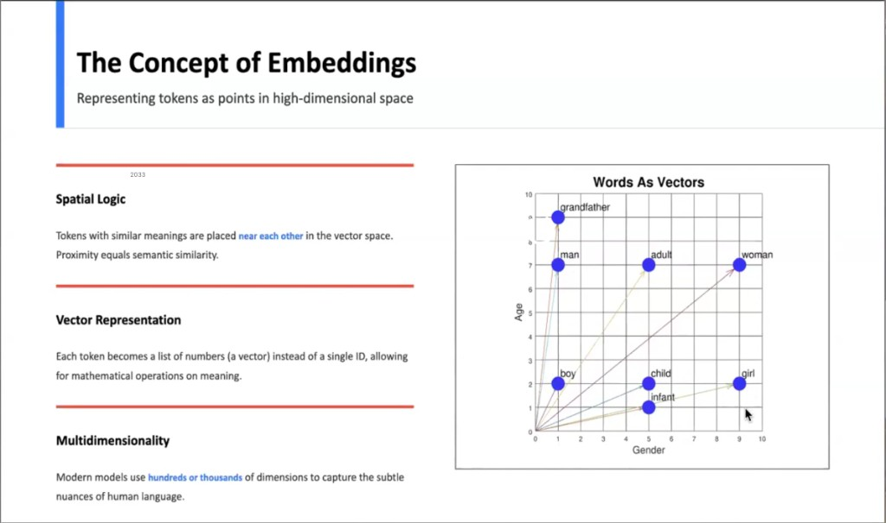

Related ideas in high dimensions:

- **Clustering** of related concepts.
- Some **directions** can align with emergent factors (e.g. analogies), though dimensions are not always human-labelable one-to-one.

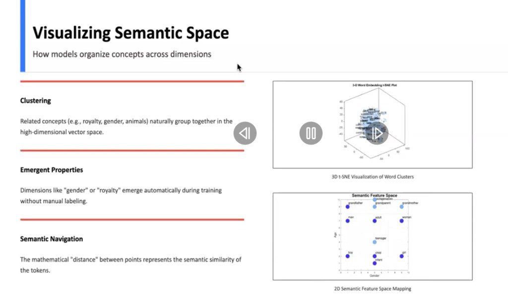

---

## Embeddings in the pipeline

The **embedding matrix** is a lookup table: token ID → row → **vector**. That vector is the token’s **initial** representation before layers mix in context. (Common sizes are model-specific—e.g. many “base” encoder models use **768** dimensions; LLMs vary widely.)

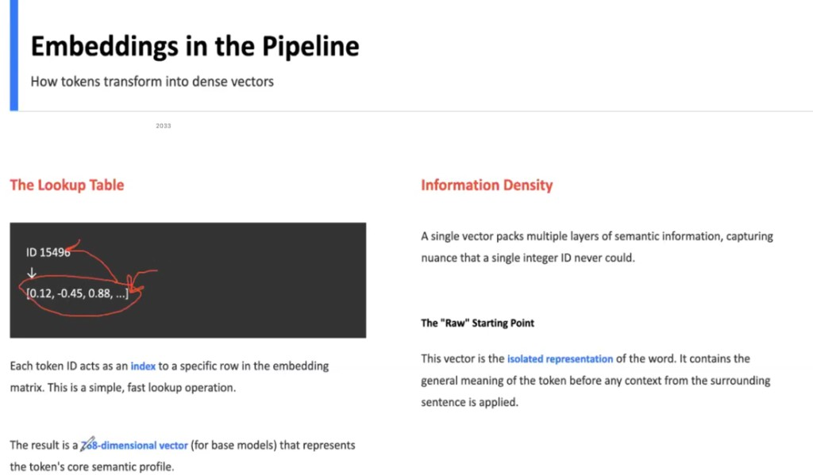

---

## Positional information

### The problem of sequence

**Self-attention** (by default) is **permutation-invariant**: without extra structure, `"The dog bit the man"` and `"The man bit the dog"` can look like the **same multiset of tokens**. In language, **order** carries **who did what to whom**.

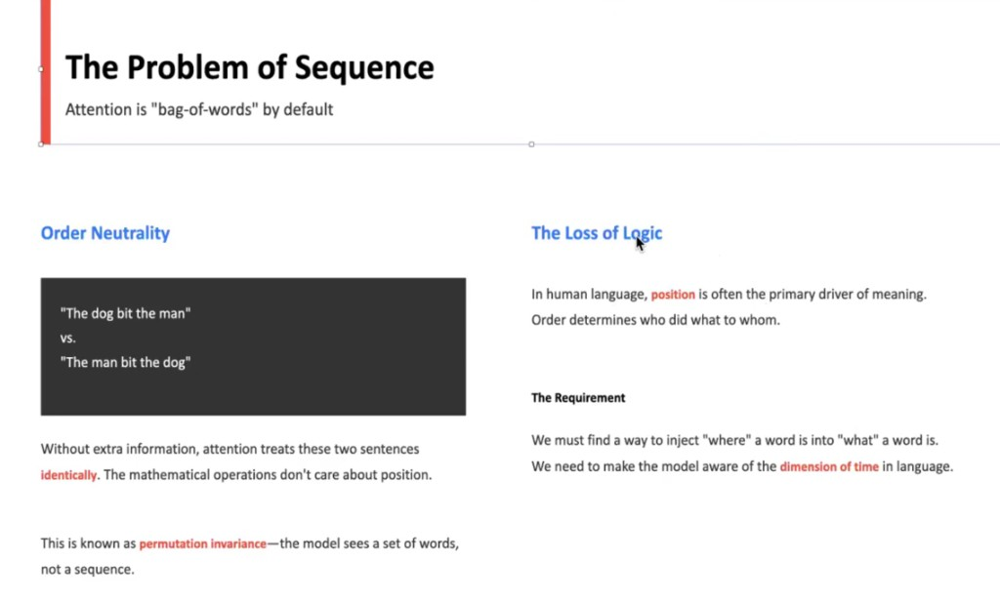

### Positional encoding

Transformers process tokens in parallel across positions, so we **inject position** explicitly—commonly by **adding** a **positional vector** to each token embedding (same width as the model). That way each position carries both **what** (token) and **where** (index).

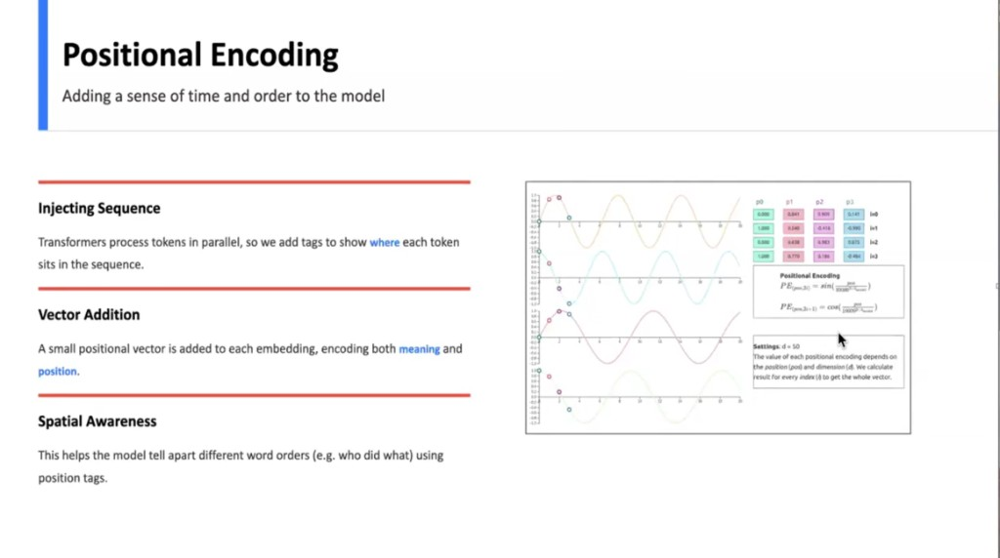

**Original Transformer (sinusoidal) encoding** uses fixed **sin** and **cos** waves at multiple frequencies so each position gets a distinct pattern. Reasons often cited:

- Helps represent **relative** position relationships.
- **No extra learned parameters** for the base pattern (fixed precomputed curves).
- **Multi-frequency** patterns act like a unique “fingerprint” per position.
- Smooth waves can help **generalize** to somewhat longer sequences than seen in training (in practice, length limits still apply).

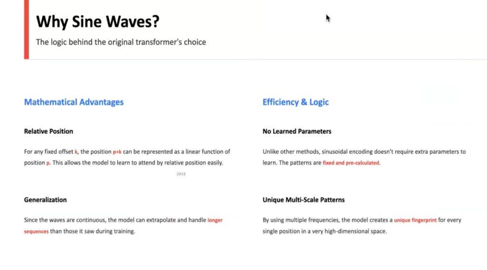

Many newer models use **learned** positional embeddings or **rotary** schemes (RoPE); the core idea remains: **position must be explicit** somewhere in the stack.

---

## Pipeline so far

End-to-end, the first stages are:

1. **Tokenization** — text → subword token IDs.  
2. **Embedding** — IDs → dense vectors.  
3. **Positional encoding** — add position so order matters.  

Then **Transformer blocks** (attention, feed-forward, residuals, normalization) refine vectors; a final **linear / softmax** maps back to vocabulary for the next-token prediction or classification.

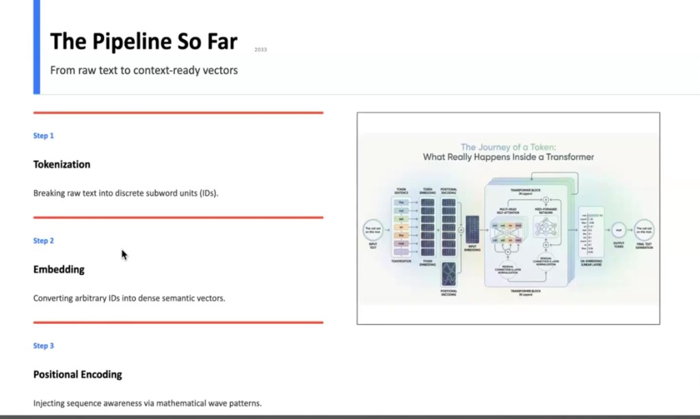
