# Self-attention and multi-head attention

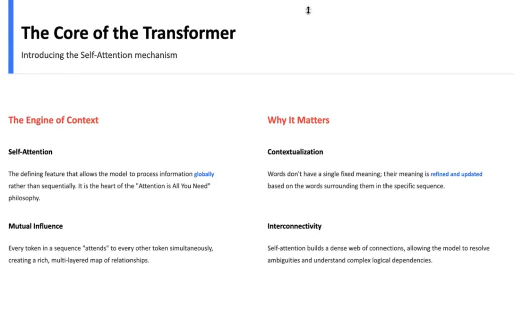

## What is self-attention?

**Self-attention** is a mechanism that lets each position in a sequence **look at** other positions and **re-weight** how much it should use their information when building a new representation.

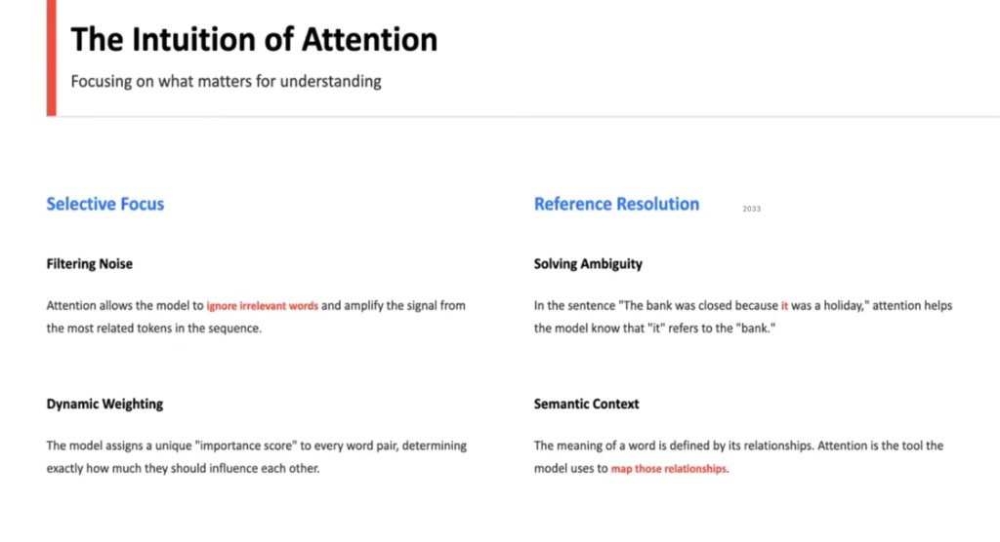

**Example:** *The bank was closed because of the strike.*

Depending on context, tokens like **strike** may receive **stronger attention** from other words than **bank** (e.g. linking “closed” to a labor strike rather than a riverbank). The model learns these patterns from data.

In short, self-attention **assigns a weight** between pairs of tokens: how relevant each word is to each other word **in this sentence**.

After **input embeddings** (and usually **positional** information), each position is projected into three vectors: **Query (Q)**, **Key (K)**, and **Value (V)**.

**Roles (informal):**

| | Question |
|---|----------|
| **Q (query)** | What am I looking for? |
| **K (key)** | What do I “advertise” for matching? |
| **V (value)** | What information do I contribute if selected? |

Compared to a **database** with an exact key lookup, attention does **soft matching**: similarities between Q and K become **continuous weights**, then values are **mixed** accordingly.

---

## The three roles (Q, K, V) in the architecture

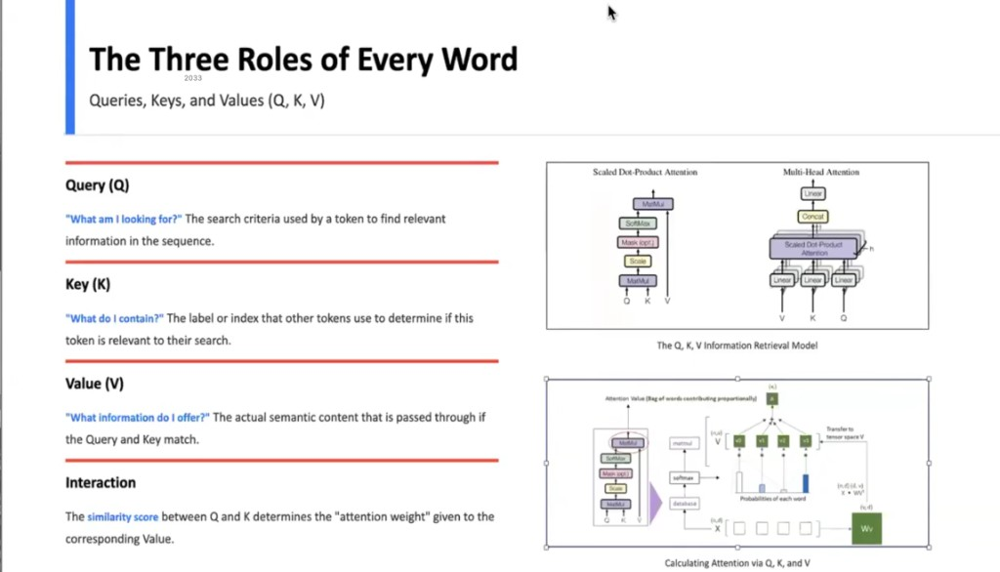

---

## Computing Q, K, and V

Each token’s embedding is multiplied by **three learned matrices** \(W_Q\), \(W_K\), and \(W_V\) to produce that token’s **Q**, **K**, and **V**. During training, the model learns projections that make attention useful for the task.

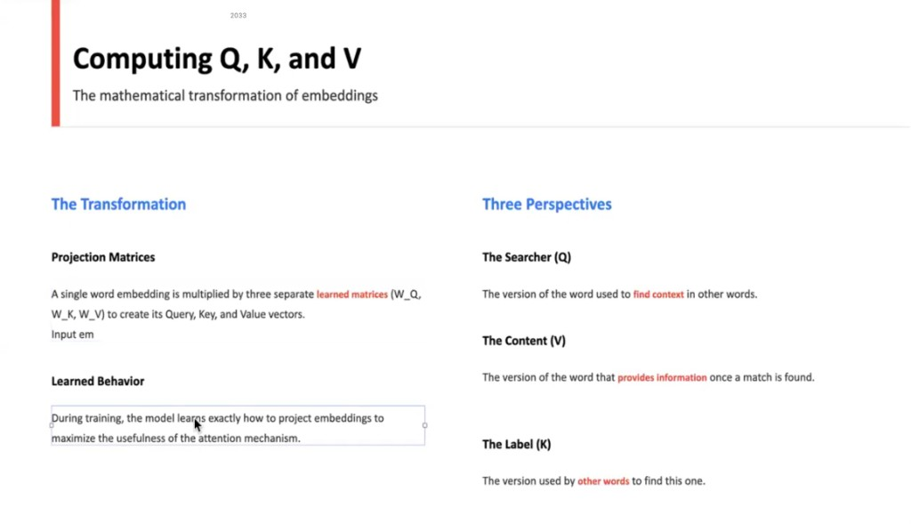

---

## The attention formula (scaled dot-product)

\[
\mathrm{Attention}(Q, K, V) = \mathrm{softmax}\left(\frac{Q K^\top}{\sqrt{d_k}}\right) V
\]

- **\(Q K^\top\)** — pairwise **similarity** scores between queries and keys (up to scaling).
- **\(\sqrt{d_k}\)** — **scaling** so dot products stay in a stable range (helps training).
- **Softmax** — turns scores into **attention weights** (non-negative, **row-wise** sum to 1).
- **Multiply by \(V\)** — **weighted sum** of value vectors → a **context-aware** output per position.

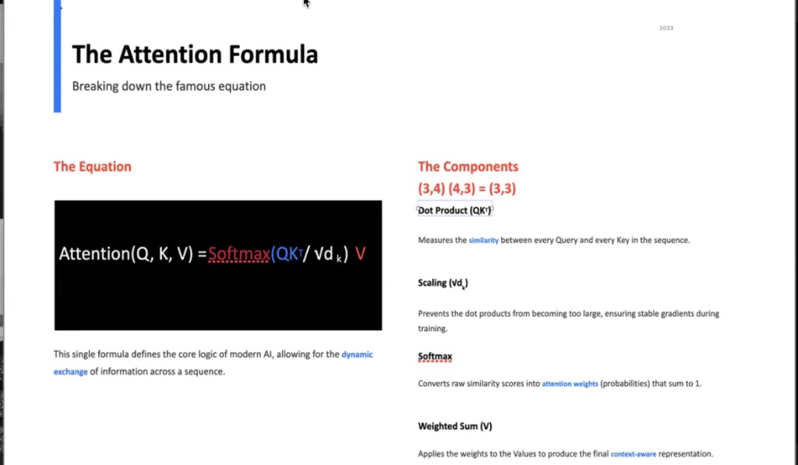

---

## Visualizing the attention matrix

For \(N\) tokens, weights often form an \(N \times N\) **heatmap**: brighter cells mean **stronger** attention. The diagonal is often prominent (**self-attention**); off-diagonal bright spots show **context** (e.g. pronoun ↔ antecedent).

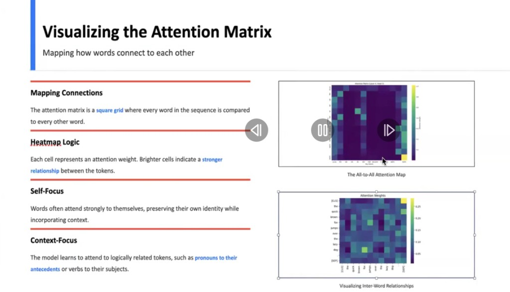

---

## Context-aware meaning

In isolation, **bank** is ambiguous (financial vs river). Attention lets the model **update** a token’s representation using neighbors (e.g. *money*, *loan*, *river*) so the vector reflects **this** instance’s meaning.

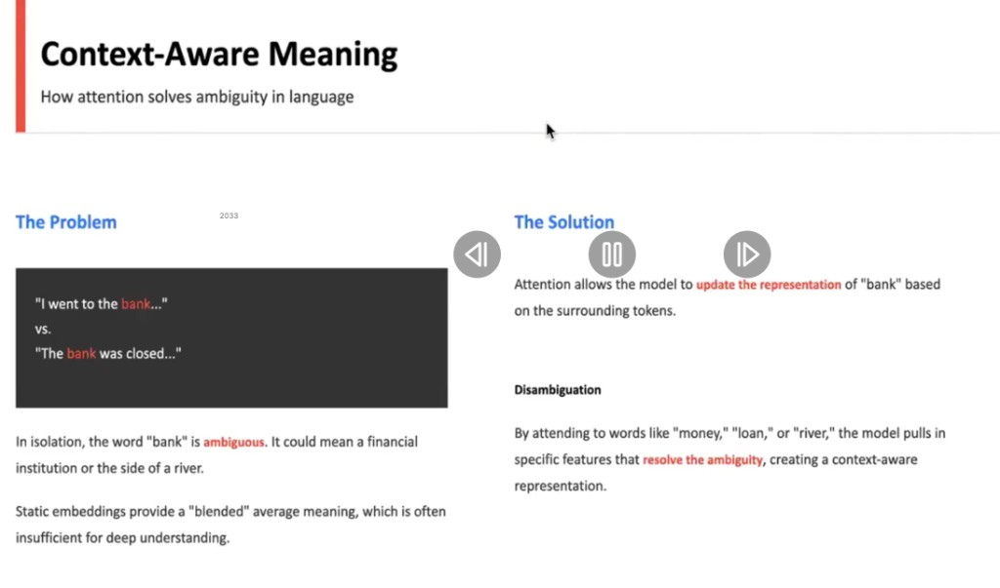

---

## Example walkthrough: resolving *it*

*The animal didn’t cross the street because **it** was too tired.*

The model can use attention so that **it** pulls more from **animal** than **street** in context.

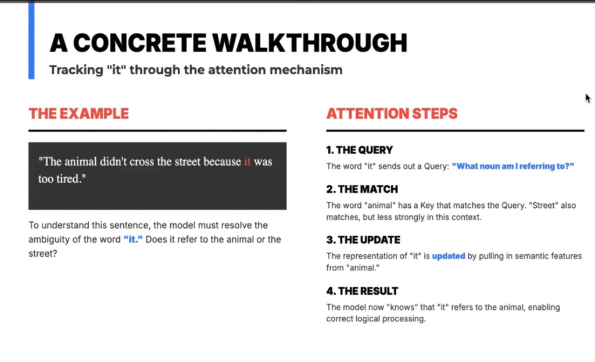

---

## Generation: token by token

At inference, text is often generated **autoregressively**: each step appends a token, then attention runs over the **full sequence so far** to predict the next one.

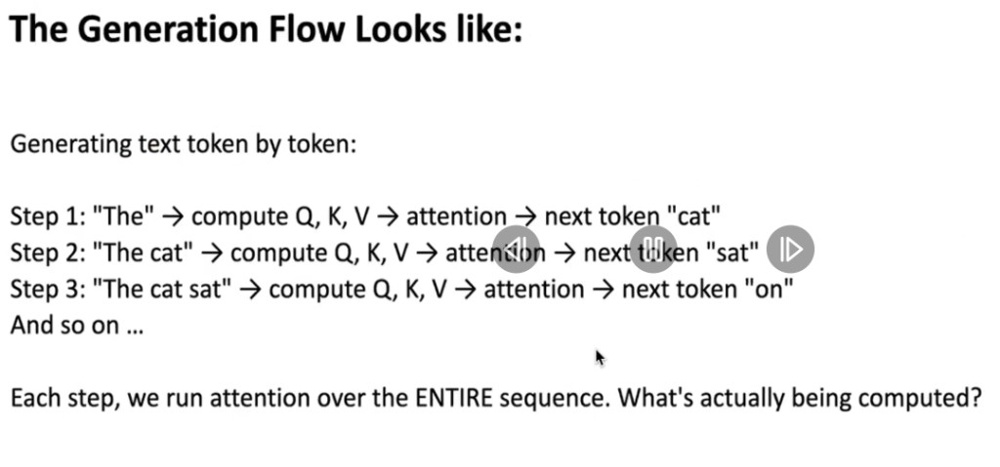

When predicting the next token, the **new** position’s **Q** is new; **K** and **V** for **previous** tokens are unchanged from their last computation.

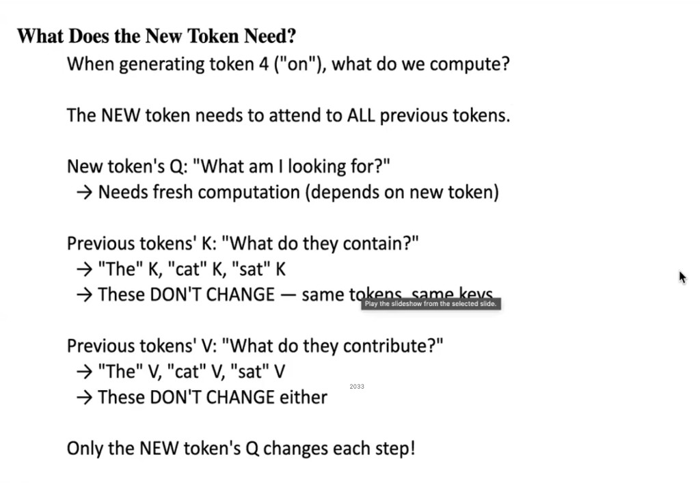

---

## KV cache

To avoid recomputing **K** and **V** for every past token at every step, implementations **cache** them after the first pass. Each new step only computes **K** and **V** for the **newest** token (and a fresh **Q** for the position being scored).

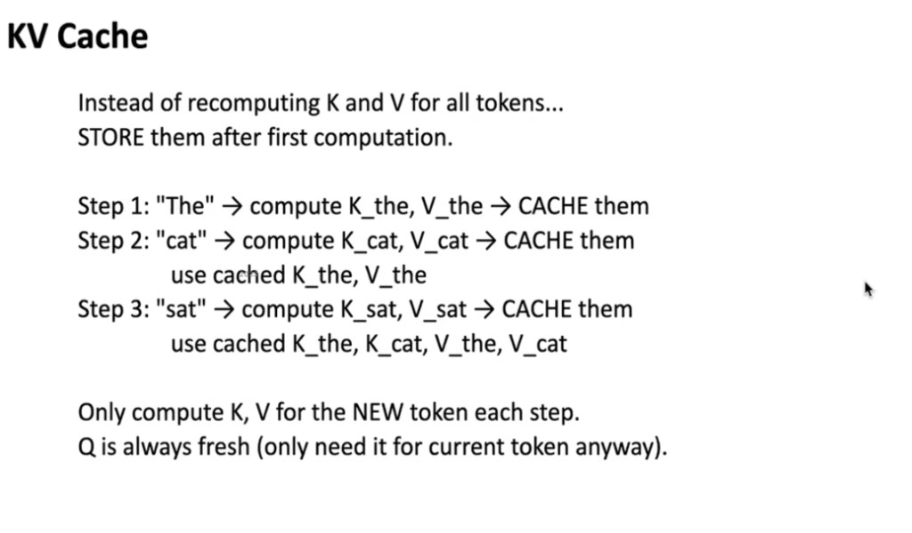

---

## Why is the first token slow?

The **first generated** token is expensive because the model must ingest the **entire prompt**, compute **K** and **V** for **every** prompt token, **fill the KV cache**, and only then emit the first answer token.

**Later** tokens are cheaper: **K**/**V** for the prompt (and prior outputs) are **already cached**; you mostly add one new token’s computations.

So **time-to-first-token** and **tokens per second** measure different things.

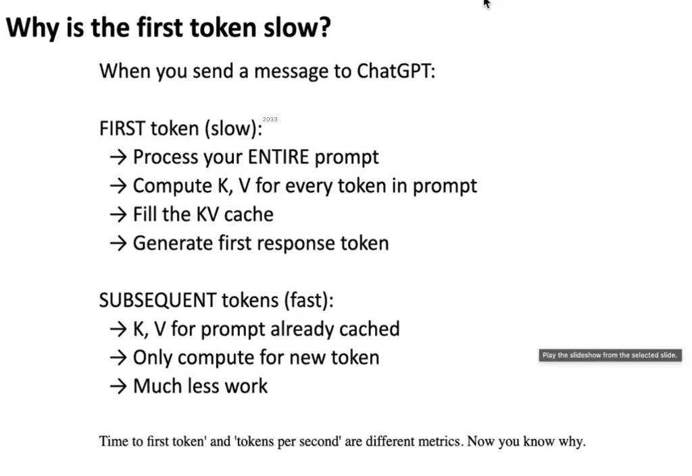

The cache **grows with sequence length**: each layer stores **K** and **V** for all positions—very long contexts mean **large** memory and can slow work even with caching.

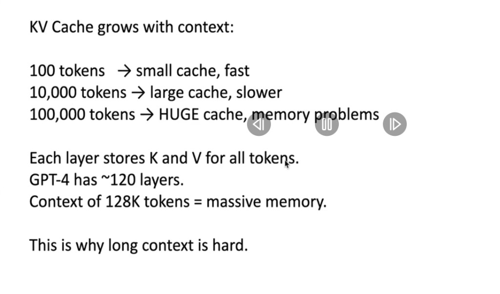

---

## Multi-head attention

Multiple **heads** run attention **in parallel** with **different** learned \(W_Q, W_K, W_V\). Heads can specialize (e.g. syntax, coreference, local neighbors, broader relations). Outputs are **concatenated** and usually passed through a **linear** layer back to model width.

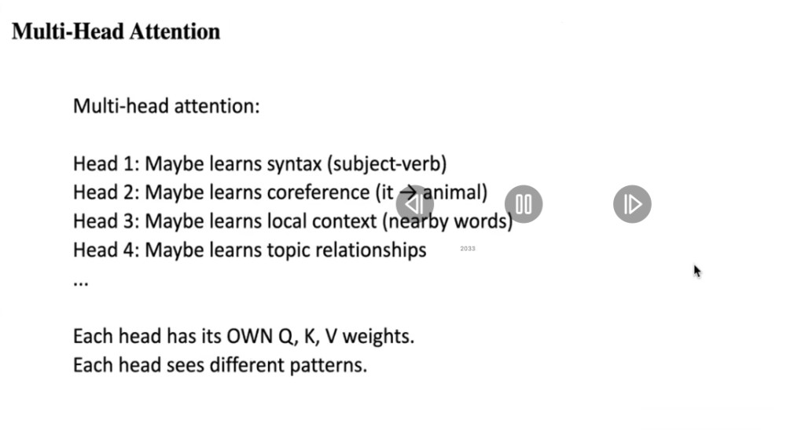

**How many heads?** If \(d_{\text{model}}\) is fixed (e.g. 768), **more heads** means **smaller** per-head dimension. Too many tiny heads can be weak; too few heads limit diversity. **8–32** heads is a common range in practice.

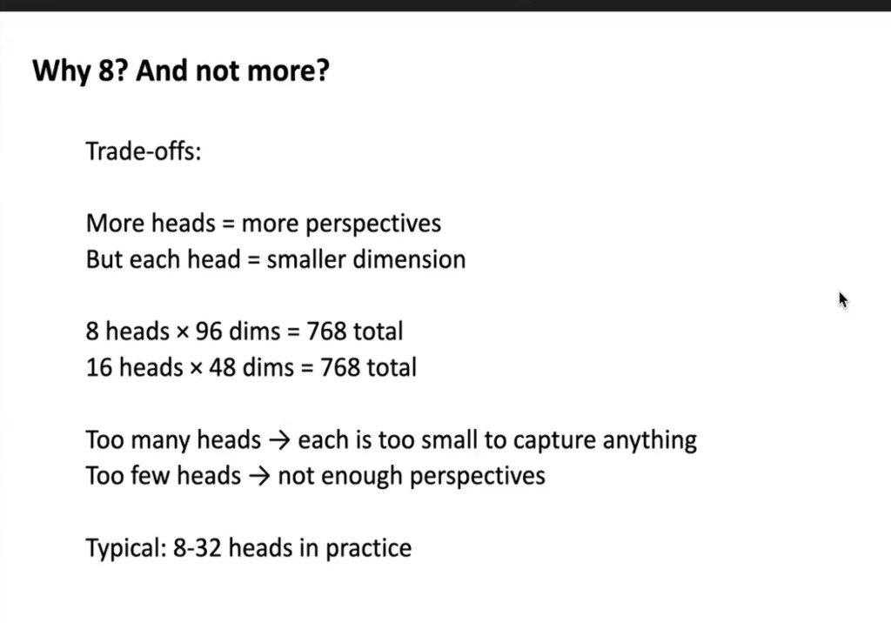

Example: \(d_{\text{model}} = 768\) with **8 heads** → **96** dimensions per head for Q, K, and V; attention runs per head, then heads are **concatenated** and **projected** back to 768.

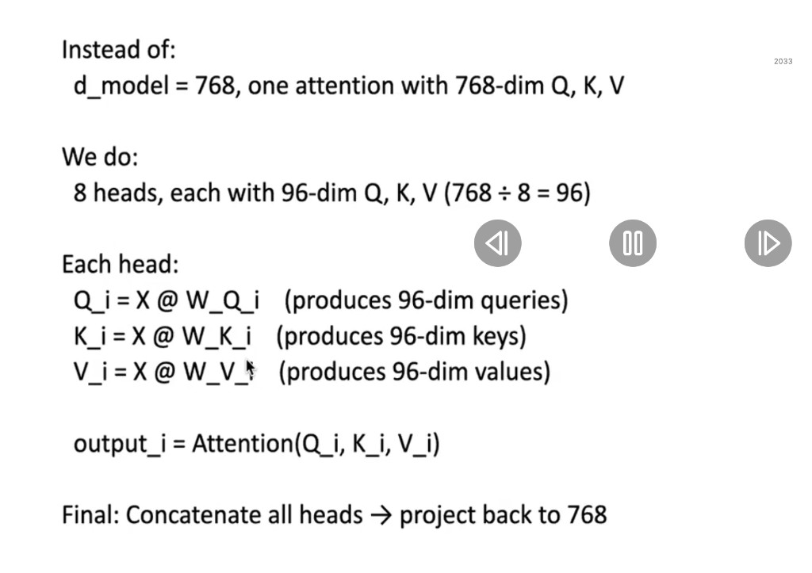

---

## Journey of a token (end-to-end)

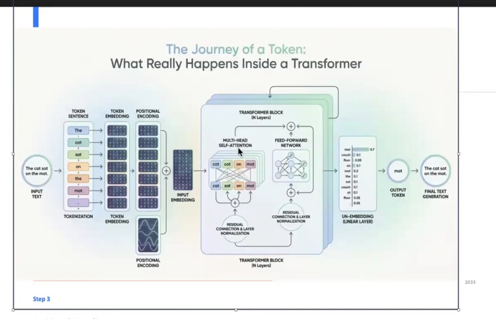
